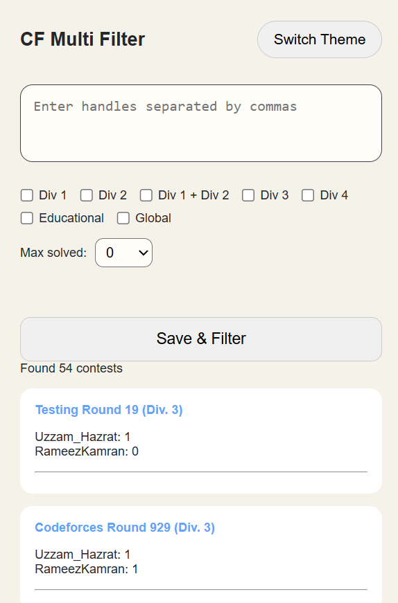
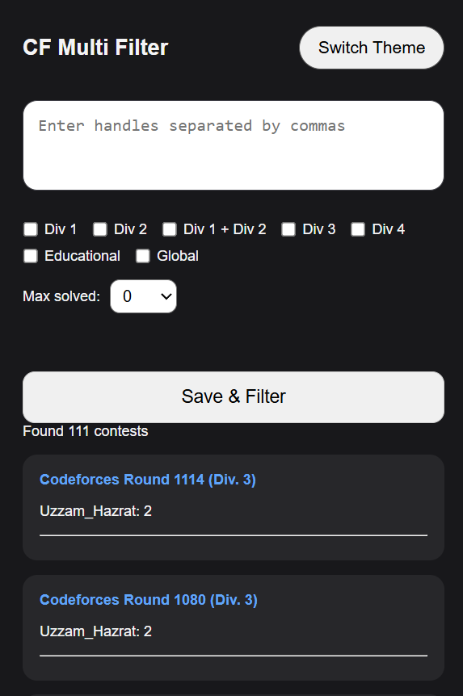
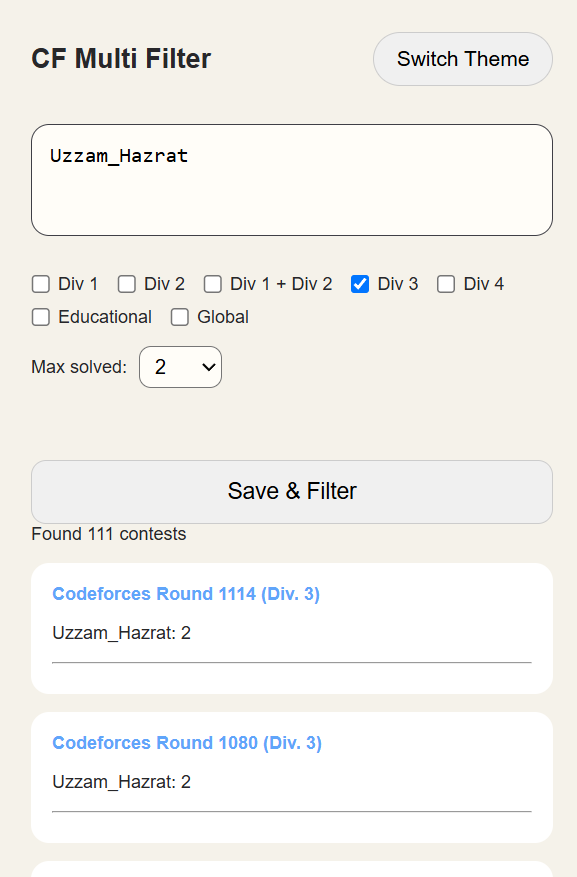
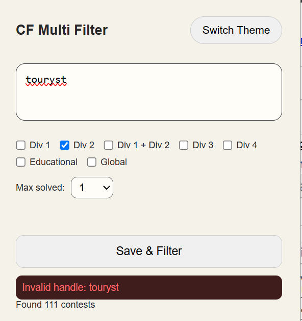

# CF Multi Filter

A Chrome extension that helps competitive programmers find Codeforces contests based on multiple users and their solved problems.

## Features

- Filter contests using multiple Codeforces handles
- Find contests where selected users solved at most **K** problems
- Supports contest types:
  - Div. 1
  - Div. 1 + Div. 2
  - Div. 2
  - Div. 3
  - Div. 4
  - Educational Rounds
  - Global Rounds
- Dark and light themes
- Invalid handle detection
- Quick links to contests

## Screenshots

## Screenshots

### Main UI (Light Theme)


### Dark Theme


### Filter Results


### Error Handling


## Installation

### Chrome

1. Clone this repository:

```bash
git clone https://github.com/RameezKamran/Codeforces-Multi-Filter.git
